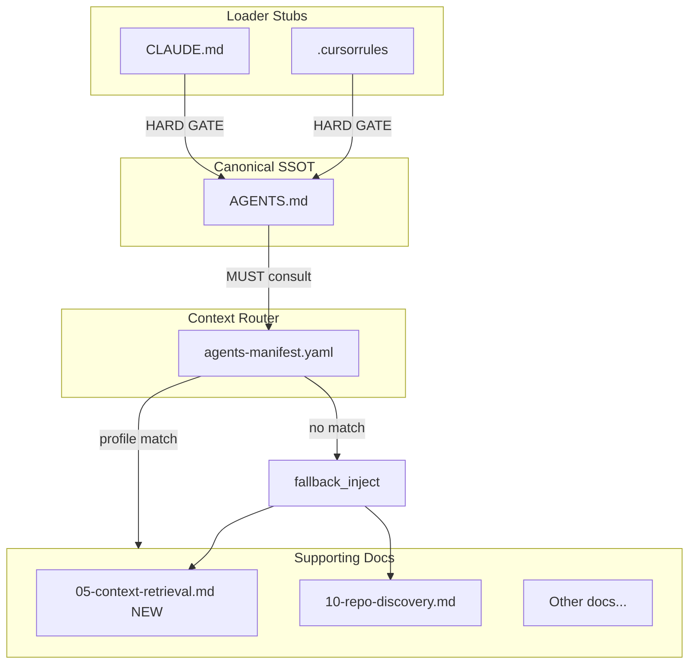

# Context Injection Hardening Plan

## Problem Statement

The current architecture has implicit injection procedures that agents may skip in auto-mode, and lacks guidance on how to perform thorough context retrieval (grep, semantic search, file reads) to avoid incomplete reasoning.

## Architecture After Changes



---

## File Changes

### 1. Update [AGENTS.md](AGENTS.md) - Make Manifest Lookup Mandatory

**Location:** Lines 35-37 (Mandatory Execution Loop, step 2)

**Current:**

```markdown
2) **Discover** relevant files and existing SSOT owners (constants/config/rules/workflows/etc).
   - If helpful, consult `agents-manifest.yaml` to load any conditional supporting docs/playbooks for the task.
```

**Change to:**

```markdown
2) **Discover** relevant files and existing SSOT owners:
   - **MUST** consult `agents-manifest.yaml` and execute the Context Injection Procedure (see below).
   - Search for existing SSOT owners (constants/config/rules/workflows) per `docs/agents/10-repo-discovery.md`.
```

**Add new section** after line 43 (after "Report" step):

```markdown
## Context Injection Procedure (Hard Gate)

Before reasoning or implementing, agents MUST:

1. Extract keywords from user prompt and referenced files.
2. For each profile in `agents-manifest.yaml`:
   - Match `detect.keywords` (case-insensitive substring in prompt/file content).
   - Match `detect.code_patterns` (regex against code in scope).
   - Match `detect.file_globs` (against files referenced or being edited).
3. For ALL matching profiles, READ every file in that profile's `inject` list.
4. If no profile matches, READ the `fallback_inject` list.
5. If multiple profiles match, inject the UNION of all inject lists (not first-match).
6. Follow context retrieval best practices in `docs/agents/05-context-retrieval.md`.
```

---

### 2. Update [.cursorrules](.cursorrules) - Add Explicit Procedure

**Replace entire content with:**

```markdown
# .cursorrules (Loader Stub)

Hard gate:
- Before doing any work, open and follow `AGENTS.md`.
- If you cannot access repository files, request that the user paste `AGENTS.md`.
- Do not implement changes unless `AGENTS.md` is in-context.

Context injection (REQUIRED):
1. Read `agents-manifest.yaml`.
2. Match task keywords/patterns against all profiles.
3. READ all files from matching profiles' `inject` lists (union if multiple match).
4. If no match, READ `fallback_inject` list.
5. Follow `docs/agents/05-context-retrieval.md` for grep/search/read best practices.

If any conflict exists, `AGENTS.md` is authoritative.
```

---

### 3. Update [CLAUDE.md](CLAUDE.md) - Mirror .cursorrules

Same content as `.cursorrules` above (keep them identical as loader stubs).

---

### 4. Update [agents-manifest.yaml](agents-manifest.yaml) - Add Injection Rules

**Add after line 9 (after `default_inject`):**

```yaml
injection_mode: union  # union | first_match — union injects all matching profiles

fallback_inject:
  - "docs/agents/05-context-retrieval.md"
  - "docs/agents/10-repo-discovery.md"
  - "docs/agents/30-logging-errors.md"

semantic_queries:
  # Pre-defined queries agents can use for embedding-based search when profile matches
  excel_automation:
    - "How is Excel COM lifecycle managed in this repo?"
    - "Where is the Excel quit/kill fallback implemented?"
  gui_task:
    - "How is GUI thread safety enforced?"
    - "Where is the queue/drain pattern implemented?"
  dual_entry_template:
    - "How does the CLI vs GUI entry dispatcher work?"
    - "Where are workflow scenarios registered?"
  bugfix:
    - "Where is the failing functionality implemented?"
    - "What SSOT owns this behavior?"
```

---

### 5. Create [docs/agents/05-context-retrieval.md](docs/agents/05-context-retrieval.md) (NEW)

**Full content:**

```markdown
---
doc_type: runbook
ssot_owner: AGENTS.md
update_trigger: context retrieval expectations or tool capabilities change
---

# 05 — Context Retrieval Best Practices (Hard Gate)

Goal: ensure agents retrieve complete, relevant context before reasoning or implementing.

## Principle: Over-Fetch, Then Filter

Incomplete context causes incorrect reasoning. When uncertain, retrieve MORE context than you think you need, then filter during analysis.

## Grep / Ripgrep Best Practices

### 1. Use Multiple Search Passes
- First pass: exact symbol/function name
- Second pass: related terms (caller, callee, test, mock)
- Third pass: file glob to catch config/constants

### 2. Always Include Context Lines
```

rg -C 5 "pattern"     # 5 lines before AND after

rg -B 10 "pattern"    # 10 lines before (for imports/class def)

rg -A 20 "pattern"    # 20 lines after (for full function body)

```

### 3. Search for Call Sites, Not Just Definitions
```

rg "function_name\("   # calls

rg "def function_name" # definition

rg "function_name"     # all references

```

### 4. Use File Type Filters
```

rg --type py "pattern"     # Python only

rg --type md "pattern"     # Docs only

rg -g "*.yaml" "pattern"   # Config files

```

## Semantic Search Best Practices

### 1. Ask Complete Questions
- Bad: `AuthService`
- Good: `Where is user authentication performed before API calls?`

### 2. One Concept Per Query
- Bad: `How does auth work and where is logging configured?`
- Good: Query 1: `How does authentication work?` Query 2: `Where is logging configured?`

### 3. Use Profile-Defined Queries
When a profile matches in `agents-manifest.yaml`, use queries from `semantic_queries.<profile>` as starting points.

### 4. Narrow, Then Broaden
- Start with specific directory if known
- If insufficient results, broaden to repo root
- If too many results, add qualifying terms

## File Read Best Practices

### 1. Read Full Files for Small Files (<200 lines)
Do not use offset/limit for small files—context at top (imports) and bottom (exports/main) matters.

### 2. For Large Files, Read in Chunks with Overlap
- Read lines 1-100 (get imports, class definition)
- Read lines around the target symbol (use grep to find line number first)
- Read last 50 lines (exports, `if __name__`)

### 3. Always Read Related Files Together
When reading a module:
- Its test file (`test_<module>.py` or `<module>_test.py`)
- Its config/constants if referenced
- Its parent package `__init__.py`

### 4. Read Before Editing
NEVER edit a file you haven't read. Even for "simple" changes, context matters.

## Anti-Patterns (Hard Reject)

- Grepping for one symbol and assuming you found all usages
- Reading only the function body without imports/class context
- Semantic search with single-word queries
- Assuming file structure without `ls` verification
- Editing based on error messages without reading the file first

## Checklist Before Reasoning

- [ ] Grepped for primary symbol AND related terms
- [ ] Read full file (or chunked with overlap for large files)
- [ ] Read test file if exists
- [ ] Read config/constants if referenced
- [ ] Checked `agents-manifest.yaml` for applicable profile and injected docs
- [ ] If semantic search used, asked complete questions (not keywords)
```

---

### 6. Update [docs/agents/index.md](docs/agents/index.md) - Add New Doc Reference

**Add after line 6 (after "Core docs:" header):**

```markdown
- Context retrieval: `docs/agents/05-context-retrieval.md`
```

---

## Validation

After changes, run existing validation scripts:

- `scripts/check_docs_ssot.ps1` — verify new doc has required headers
- `scripts/check_agents_manifest.ps1` — verify manifest references are valid