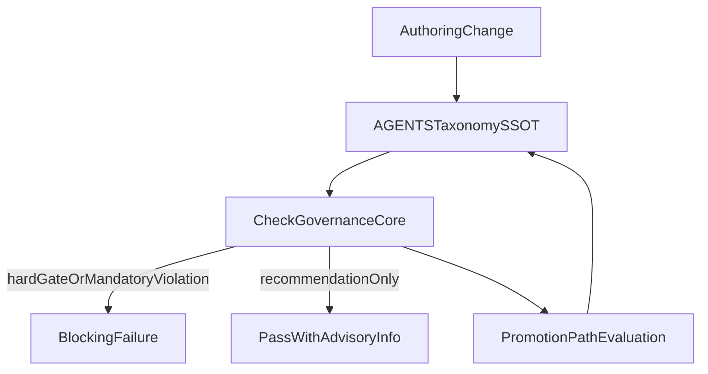

# Requirement Language Enforcement Plan

## Goal and acceptance criteria

- Establish one canonical definition of requirement strength so agents cannot reinterpret wording.
- Enforce immediately (blocking) and repo-wide for markdown/docs, per your selected defaults.
- Allow many recommendations intentionally, while preventing accidental promotion to mandatory/hard-gate strength.
- Add a promotion pathway so recommendations can be intentionally elevated with evidence.

## Locked decisions from you

- `mandatory/required` violations: block immediately.
- Enforcement scope: repo-wide docs/markdown (not just governance core).

## Pre-change council summary (merged)

- `phase`: `pre_change`
- `intent_coverage`: `ssot_duplication`, `silent_error`, `edge_case`, `resource_security_perf`
- `reviewers`: `ssot-reviewer`, `edge-case-scanner`, `security-perf-auditor`, `docs-reviewer`, `governance-learner`, `test-coverage-checker`
- `findings`: high-confidence drift risk from mixed wording semantics and partial enforcement; current checks only cover hard-gate parity in one playbook.
- `reconciliation_decision`: accept findings; enforce by centralizing semantics in one owner and adding deterministic checker rules.
- `go_no_go`: `hold` until canonical taxonomy + checker are introduced together (same change set), then `go`.

## Authority map (single-owner design)

- Canonical semantics + precedence + inheritance: [AGENTS.md](AGENTS.md)
- Docs-policy pointer only (no duplicate semantics): [docs/agents/25-docs-ssot-policy.md](docs/agents/25-docs-ssot-policy.md)
- Prompt/playbook application examples: [docs/agents/playbooks/governance-learnings-template.md](docs/agents/playbooks/governance-learnings-template.md), [docs/agents/playbooks/ai-coding-prompt-template.md](docs/agents/playbooks/ai-coding-prompt-template.md), [docs/agents/playbooks/project-docs-template.md](docs/agents/playbooks/project-docs-template.md)
- Deterministic enforcement engine: [scripts/check_governance_core.py](scripts/check_governance_core.py)
- Operator command SSOT: [README.md](README.md)

## Enforcement architecture

## Implementation phases

### Phase 1: Canonical taxonomy in AGENTS

- Add one new section in [AGENTS.md](AGENTS.md): `Requirement Language Levels (Hard Gate)`.
- Define exact semantics:
  - `Hard Gate`: blocking invariant; violation requires stop/hold.
  - `mandatory/required`: compulsory procedure rule; violation is blocking per your preference.
  - `recommendation`: advisory guidance; unlimited count allowed.
- Define precedence and inheritance:
  - authority precedence (`AGENTS.md` wins), level precedence (hard gate > mandatory > recommendation), and conflict rule (highest level wins).
- Define reserved wording rules (case-sensitive where needed), including where `MUST` is allowed.

### Phase 2: Immediate repo-wide checker enforcement

- Extend [scripts/check_governance_core.py](scripts/check_governance_core.py) with a dedicated wording-taxonomy check stage.
- Scan all repo markdown docs (repo-wide), with deterministic exclusions for non-authoritative/generated areas where appropriate.
- Enforce blocking rules:
  - hard-gate terms outside authorized zones,
  - `MUST` misuse outside allowed contexts,
  - mandatory tokens inside explicitly recommendation sections,
  - local re-definition of taxonomy outside [AGENTS.md](AGENTS.md).
- Keep parsing robust (ignore fenced-code examples, handle multiline bullets, deterministic ordering of violations).

### Phase 3: Normalize high-impact docs and templates

- Align wording to canonical taxonomy in:
  - [docs/agents/playbooks/governance-learnings-template.md](docs/agents/playbooks/governance-learnings-template.md)
  - [docs/agents/playbooks/ai-coding-prompt-template.md](docs/agents/playbooks/ai-coding-prompt-template.md)
  - [docs/agents/playbooks/project-docs-template.md](docs/agents/playbooks/project-docs-template.md)
  - [docs/agents/index.md](docs/agents/index.md)
  - [docs/agents/25-docs-ssot-policy.md](docs/agents/25-docs-ssot-policy.md)
- Remove or convert any local semantic definitions so only [AGENTS.md](AGENTS.md) defines levels.

### Phase 4: Promotion workflow (recommendation -> mandatory -> hard gate)

- Add explicit promotion criteria in [AGENTS.md](AGENTS.md) and wire to governance learning workflow in [docs/agents/playbooks/governance-learnings-template.md](docs/agents/playbooks/governance-learnings-template.md).
- Promotion gates:
  - recommendation -> mandatory: evidence of repeatable risk + deterministic witness.
  - mandatory -> hard gate: explicit user confirmation + enforcement witness + council `go_no_go = go`.
- Record promotion evidence in existing change-record flow under [docs/project/change-records/](docs/project/change-records/) using [docs/agents/schemas/change-record.schema.json](docs/agents/schemas/change-record.schema.json).

### Phase 5: Verification and release gating

- Update [README.md](README.md) `Checks` to include any new deterministic wording-enforcement invocation before using it.
- Run baseline checks from README plus wording-enforcement checks via [scripts/check_governance_core.py](scripts/check_governance_core.py).
- Execute at least one failure-path witness (intentional bad wording fixture or controlled malformed sample) to prove blocking behavior.

## Invariants and witnesses

- Data invariant: each requirement statement maps to exactly one level category.
- Ordering invariant: taxonomy is defined in [AGENTS.md](AGENTS.md) before downstream docs reference it.
- Observability invariant: checker emits explicit file-level violations and blocking result.
- Idempotency invariant: re-running checker without content changes yields identical results.
- Witnesses:
  - checker pass/fail logs from [scripts/check_governance_core.py](scripts/check_governance_core.py),
  - README check list includes the new enforcement command,
  - at least one deliberate failure-path demonstration captured in verification notes.

## Residual risks to track

- False positives from quoted examples if parser boundaries are incomplete.
- Legacy docs with mixed wording may trigger large initial violation volume under immediate-blocking mode.
- Shadow semantics in auxiliary docs can reappear unless checker covers all markdown scope consistently.

